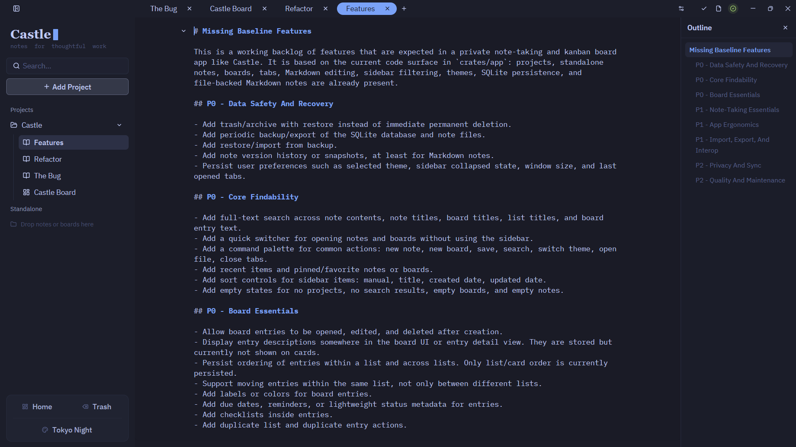
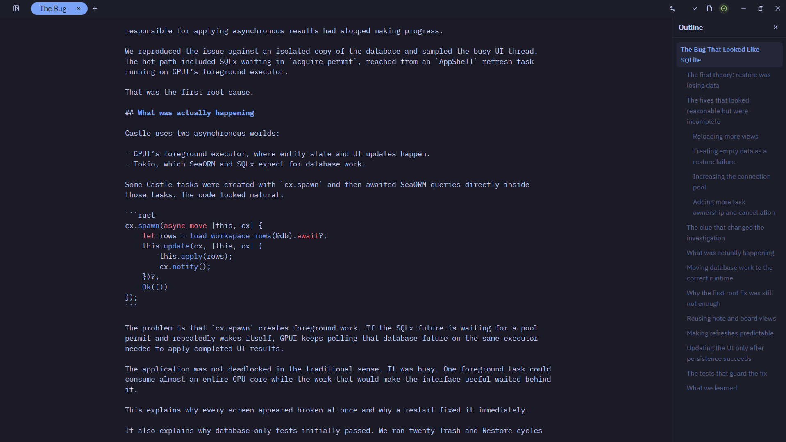
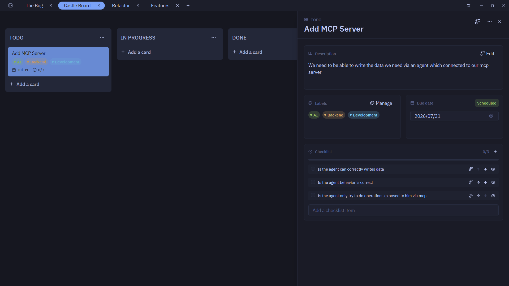

# Castle

Castle is a native note-taking and kanban board app for Linux built with Rust and [GPUI Kit](https://github.com/longbridge/gpui-kit).

## Build & Run on Linux

Prerequisites:
- A Linux environment (Wayland or X11)
- Rust toolchain (`cargo`, `rustc`)

```bash
# Check code
make check

# Run tests
make test

# Run the app
make run
```

## Notes

Write focused notes with Markdown and code blocks.





## Boards

Organize work visually with kanban boards, cards, labels, checklists, and due dates.


